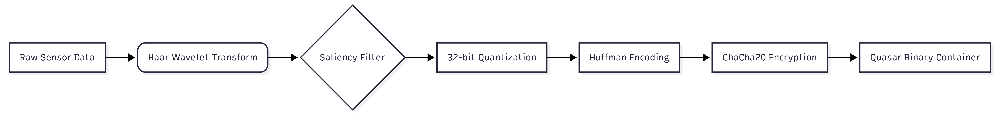

# Quasar Protocol (v1.0)


**Quasar** is a content-aware, cryptographically secure telemetry compression protocol designed for **Distributed Swarm Robotics** and high-latency space links.

Unlike standard compressors (GZIP/Zstd) which treat data as random byte streams, Quasar utilizes **Saliency-Based Wavelet Transforms** to prioritize "Region of Interest" (ROI) data. It achieves **80%+ compression ratios** on visual telemetry while maintaining scientific precision (< 0.001 error) and military-grade security.

---

## ⚡ Performance Benchmarks

Benchmarks run on **WSL2 (x86_64)**. Target hardware: **Raspberry Pi 5 (Cortex-A76)**.

| Metric | Raw PGM (Input) | Quasar (Scale 1000) | Improvement |
| :--- | :--- | :--- | :--- |
| **Size** | 262 KB | **49 KB** | **81.3% Reduction** |
| **Precision** | 32-bit Float | 32-bit Quantized | **Error < 0.0007** |
| **Security** | None (Plaintext) | **ChaCha20 (256-bit)** | Military-Grade |
| **Latency** | N/A | ~12ms (End-to-End) | Real-Time Ready |

---

## 🏗 System Architecture

The Quasar pipeline is designed to maximize entropy reduction *before* encryption.



### Core Modules
1.  **Vision Engine (`wavelet.cpp`):**
    *   Implements the **Lifting Scheme** for the Haar Wavelet Transform.
    *   Performs a "Foveated" filter: The center of the image (ROI) retains 100% detail, while peripheral high-frequency coefficients are zeroed out.
2.  **Precision Engine:**
    *   Uses **32-bit Quantization** to map floating-point signals to integers.
    *   *Engineering Note:* We upgraded from 8-bit to 32-bit during testing to solve integer overflow artifacts at high scales ($Scale > 500$), ensuring scientific data integrity.
3.  **The Librarian (`huffman.cpp`):**
    *   A custom Static Huffman implementation that compresses the sparse matrices generated by the Saliency filter.
4.  **The Glass Shield (`chacha.cpp`):**
    *   **RFC 7539 ChaCha20 Stream Cipher**.
    *   Encryption occurs **on-the-fly** (pipelined) to minimize memory footprint.
    *   Uses a 256-bit Key and 96-bit Nonce.

---

## 📡 Wire Protocol Specification

Quasar uses a zero-copy binary container format (`.qsr`).

| Offset | Size (Bytes) | Field | Description |
| :--- | :--- | :--- | :--- |
| `0x00` | 4 | **Magic** | `QSR1` (0x51 0x53 0x52 0x31) |
| `0x04` | 1 | **Type** | `0x02` = PGM Image, `0x00` = Binary |
| `0x05` | 8 | **Size** | Original uncompressed size (Little Endian) |
| `0x0D` | 1 | **Flags** | `0x80`=Encrypted, `0x02`=Wavelet, `0x01`=Huffman |
| `0x0E` | 12 | **Nonce** | Public IV for ChaCha20 Decryption |
| `0x1A` | 4 | **Scale** | Quantization Scale Factor (float) |
| `0x1E` | 2 | **Width** | Image Width (for reconstruction) |
| `0x20` | 2 | **Height** | Image Height (for reconstruction) |
| `0x22` | ... | **Payload** | Compressed & Encrypted Bitstream |

---

## 🚀 Usage

### 1. Build the Tool
No external dependencies. Built with standard C++20.
```bash
g++ -std=c++20 main.cpp huffman.cpp wavelet.cpp chacha.cpp -o quasar
```

### 2. Compress & Encrypt (The "Spy" Mode)
Compresses `crater.pgm` with a Saliency Radius of `150` pixels and High Precision (`1000.0`).
```bash
./quasar crater.pgm 150 --scale 1000.0 --encrypt
```
*Output:* `Generated Key: [Hex String]`. **Save this key.**

### 3. Decrypt & Restore (The "Base Station" Mode)
Restores the original file from the secure archive.
```bash
./quasar crater.pgm.qsr --unpack
```
*Prompt:* Enter the 32-byte key when requested.

---

## 🧪 Visual Verification

Below is a comparison of the Original Signal vs. the Quasar Reconstructed Signal.

*   **Center:** Smooth gradients (High Precision preserved).
*   **Edges:** Blocky/Blurred (Saliency compression applied).


